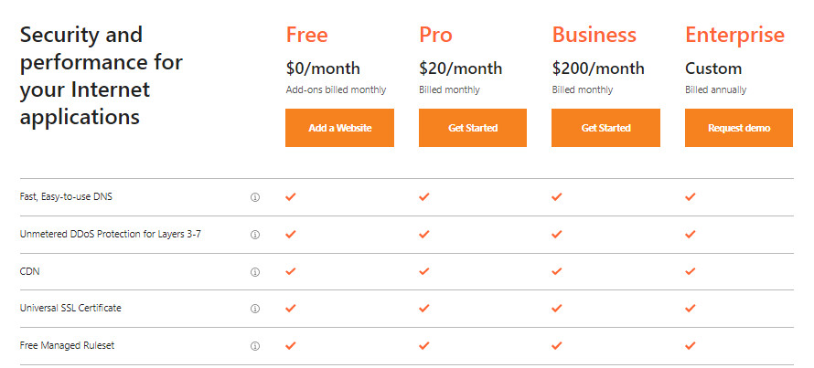
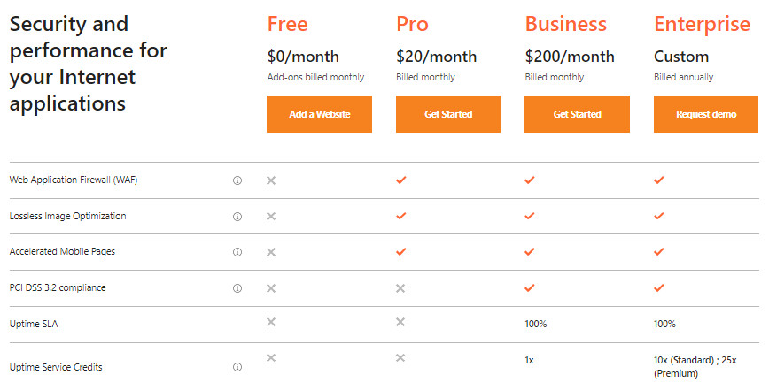
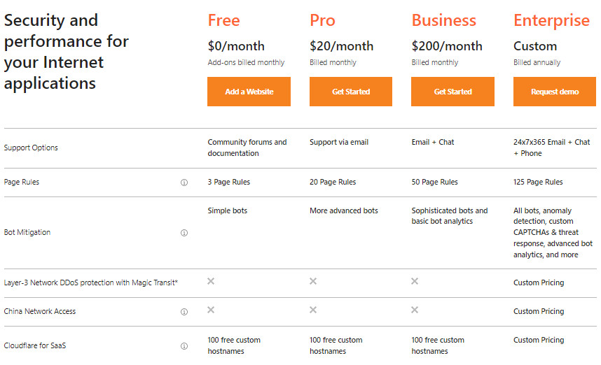
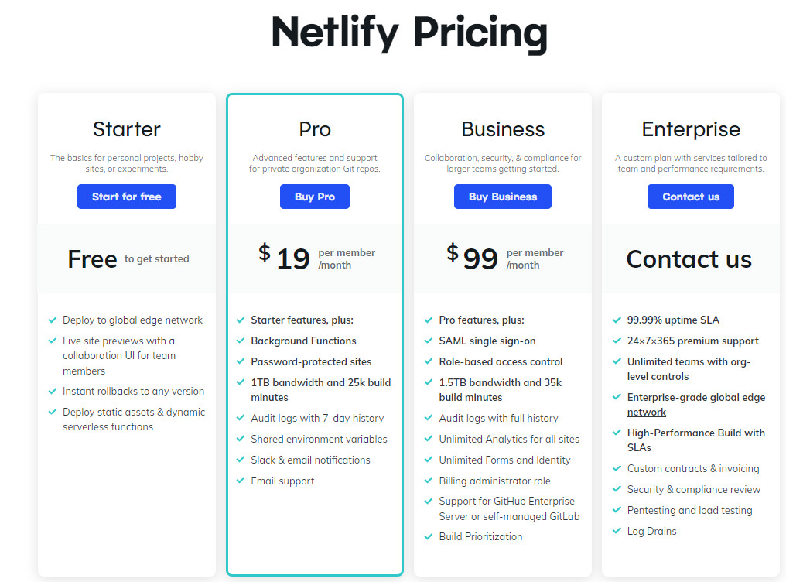

# CloudFlareについての評価

- CloudFlare Pagesについての評価に行く前に、CloudFlareに関するいくつかの情報を紹介する。

### 1. CloudFlareとは？

- CloudFlareは、CloudFlareの保護レイヤーによってサーバーとクライアント間のトラフィックを管理するDNSサービスを提供している。

- トラフィックは、DNSのドメイン名解決サーバーに直接行くのではなく、CloudFlareのドメイン名解決サーバーに行ってWebサイトのデータを見る。

- CloudFlareはCDNに似た技術を使用していると言われているが、従来のCDNとは違う。CloudFlareは、キャッシングリバースプロキシとしてより正確に述べられている。 CloudFlareはウェブサイトへのすべてのリクエストを処理する。

### 2. CloudFlareのメリットとデメリット

#### 2.1  メリット

- コンテンツをキャッシュすることでWebサイトの表示速度を高速化すること

- 帯域幅を節約できること（CloudFlareがサーバーへの直接アクセスを制限しているため）。導入前の２分の１または３分の１程度に抑える。

- セキュリティ機能を強化すること（指定国からのアクセス制限、不明IPからのアクセス禁止、Webサイトのファイアウォール、ログイン機能の厳重な保護に対応するProパッケージ）

#### 2.2 デメリット

- CloudFlareの稼働時間（アップタイム）に完全に依存すること（CloudFlareが落ちると、サイトが見れなくなる）

- ウェブのIPを公開しないことは、メリットであると同時に、セキュリティがよくないと簡単に攻撃されるデメリットもある

- ホスティングのFireWallを使うと、攻撃サイトと誤解されやすく、そのためウェブサイトがオフラインになりやすいこと

### 3. CloudFlareの導入の検討

| Factor          | Description                                                                                                                                                                                            |
| --------------- | ------------------------------------------------------------------------------------------------------------------------------------------------------------------------------------------------------ |
| **速度**      | CloudFlareは、ケースバイケースでWebサイトのトラフィックを増加させるのに役立つ。それはサーバーの設置場所によって異なる。たとえば、ユーザーからそれほど遠くない場所に置かれた場合、アクセス速度が遅くなり、その逆も同様です。|
| **Auto Minify** | Webページから不要なもの（空白や不要な文字・コメントなど）を削除し、ファイルサイズを圧縮することで、Webサイトへのアクセス速度が向上する。                                   |
| **セキュリティ**     | サーバーIPを隠すことにより攻撃が軽減できる。CloudFlareが提供する無料のCDNとSSLを使用することで、コストを削減でき、作業上も非常に便利である。                  |

> **結論**: 個人的な意見としては、CloudFlareを導入するかはサーバーの設置場所によって判断する必要がある。例えば、東雲火山ベトナムのサイトは、ベトナムのユーザーに高速でアクセスしてもらいたいのであれば、日本にサーバーを置くべきだろう（その理由は上記で分析したとおり）。また、CloudFlareを利用することで、コストを削減することができる。ただし、CloudFlareの各CDNを無料で利用することはセキュリティや安定性には注意が必要である（2022年6月22日にCloudFlareでグローバルエラーが発生し、多くのWebサイトがクラッシュした）。

### 4.CloudFlare Pages

#### 4.1 CloudFlare Pagesの概要　
 
 - 最近、Cloudflareは、無料のCloudflare Pagesサービスをリリースしたところである。これはNetlifyと似たような機能が備わって、近い将来Netlifyと競合できるように設定されている。
 
 - Cloudflare Pagesはpages.devというデフォルトのURLを提供している。アプリにカスタムドメインを設定しない場合、Cloudflare PagesサイトのURLはhttps://your-github-repo.pages.dev. のようになる。

#### 4.2 NetifyとCloudFlare pagesの比較表

|         比較項目        | Cloudflare Pages |      Netify       |
| :---------------------: | :--------------: | :---------------: |
|      カスタムドメイン      |    Yes (Free)    |    Yes (Free)     |
|       SSL (HTTPS)       |    Yes (Free)    |    Yes (Free)     |
|   Gitベースのワークフロー   |       Yes        |        Yes        |
|  サーバーレス機能   |       Yes        |        Yes        |
|  継続的デプロイ |       Yes        |        Yes        |
|     DNS Management      |       Yes        |        Yes        |
|         HTTP/3          |       Yes        |        No         |
|          QUIC           |       Yes        |        No         |
|       Global CDN        |       Yes        |        No         |
| Unlimited Collaborators |       Yes        |        No         |
|     Build Capacity      | 500 builds/month | 300 minutes/month |
|        Bandwidth        |    Unlimited     |       100GB       |
|      Team Members       |    Unlimited     |         1         |

> **上記の表を見たら、CloudFlare PagesはNetifyが提供する全てのサービスを保証できるだけでなく、Netifyよりも無制限の帯域幅（Netifyは100GBまで）や優れたビルド容量（500ビルド）などの優れた側面を備えていることが分かる。そのため、NetifyからCloudFlare Pagesに切り替えることが完全にできるかと思う。**

### 5. NetifyとCloudFlareの有料プラン

まずはNetifyとCloudFlareのそれぞれの有料プランについて分析する。最後に、どちらが当社に適しているかについて個人的な意見を述べる。

#### 5.1 CloudFlareの有料プラン

まず、無料プランとプレミアムプランでは、**Fast, Easy-to-use DNS**、**Unmetered DDoS Protection for Layers 3-7**、**CDN**、**Universal SSL Certificate**、**Free Managed Ruleset** といった機能は両方とも完全に保証されているため、説明をスキップする。さっそく無料プランとプレミアムプランの違いとなる機能を紹介する。

無料版にはWAF対応がなく、これは今後の会社Webサイト開発において非常に重要であるため、CloudFlareに移行する場合は有料版を導入することをお勧めする。

また、ページの表示速度を上げることと、スマホ画面での画像表示速度を最適化することも必要となるが（会社は小型の画面を重視しているようであるから）、CloudFlareの無料版ではそのようなことはできず、有料版のみで対応となる。

CloudFlareがPCI DSSをビジネスパッケージ以上でしかサポートしていないため、将来的に国際取引サービスを計画している場合、それを導入することも考えられる。

現在、uptime Service Creditsは、会社にとって必要なサービスではないかと思うのでこのサービスをスキップする。

サポートオプションはパッケージによって異なる。上記の図を参考にして会社の要件に応じるサポートオプションを検討することができる。

有料プランと無料プランの大きな違いは、**page rules**である。**各プランには、ページルール変更の許可で違いがある。無料プランの場合、使用できるページルールの量が少なすぎるので、有料プランを検討することをお勧めする。**

Cloudflare for SaaSについては、無料プランと有料プランは同じで、Enterprisパッケージにのみ違いがある（当社ではこれは必要ないかと思う）。

#### 5.2 Netifyの有料プラン

Netifyも同様のサービスプランをより安価に提供しているが、上記で分析した通り、CloudFlareと比べると足りない機能が多くある。また、一番気になる帯域幅については、無料プランでは帯域幅が非常に制限されているようである。企業のような組織では、帯域幅は非常に重要であり、会社の発展に大きく影響する。そして、各パッケージの帯域幅制限も異なり（Netifyで最高で1.5TB）、拡張したい場合はEnterpriseを導入する必要があるとのことである。

なお、上記の画像で紹介したサービスでは、基本的にCloudFlareのプロプランでほぼ対応できる。

#### 5.3 有料プランの評価

- まず、サポート（帯域幅やセキュリティの面、その他の要因など）をより多く受けるために、検討の上、有料プランの導入に切り替えたほうが良いかと思う。

- 有料プランを導入の場合でもNetifyとCloudFlareでは料金が異なる。CloudFlareプランはNetifyよりも高価になるが、CloudFlareプランを導入の場合、Netifyのビジネスプランで1.5TBに制限されていることに対し、CloudFlareは無制限の帯域幅を利用することができる（さらにCloudFlareは帯域幅の節約にも対応できる）。

- CloudFlareのFirewallによるセキュリティレベルは、CloudFlareへの切り替えを検討する重要な要素である。

**結論から言うと NetifyからCloudFlareへ切り替えについて検討することが可能です（有料プランを推奨）**

### 6. 参考リンク:

- https://blog.kdata.vn/cloudflare-la-gi-tat-tan-tat-ve-cloudflare-ma-ban-can-phai-biet-5436/#:~:text=Cloudflare%20l%C3%A0%20d%E1%BB%8Bch%20v%E1%BB%A5%20DNS,gi%E1%BA%A3i%20t%C3%AAn%20mi%E1%BB%81n%20c%E1%BB%A7a%20CloudFlare.

- https://phannhatchanh.com/cloudflare-pages-and-netlify/
- https://blog.cloudflare.com/
- https://developers.cloudflare.com/pages/migrations/migrating-from-netlify

- https://developers.cloudflare.com/pages/framework-guides/deploy-anything/
